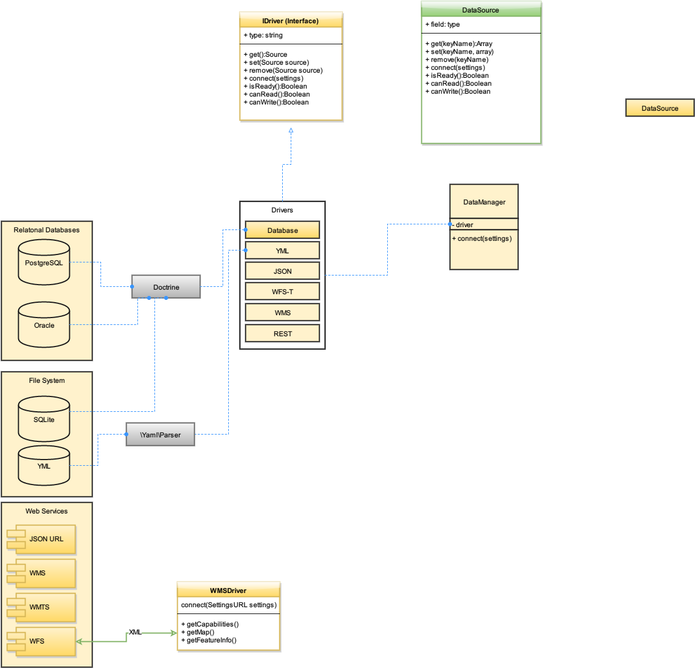

# Mapbender data source module

## Features
* Handling data sources

## Installation 
* First you need installed mapbender3-starter https://github.com/mapbender/mapbender-starter#installation project
```sh
$ composer require mapbender/data-source
```

## Update 


```sh
$ composer update mapbender/data-source
```

# Architecture


[Diagram](https://www.draw.io/?url=https%3A%2F%2Fraw.githubusercontent.com%2Fmapbender%2Fdata-source%2Fmaster%2FDocuments%2FSchema.xml)